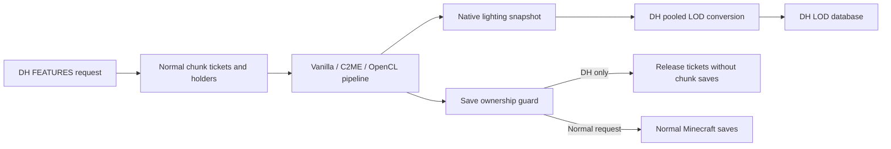

# DH C2ME Features

Fabric and NeoForge addon that sends Distant Horizons `FEATURES` requests through Minecraft's normal asynchronous chunk system, while preventing chunk, POI, and entity saves for terrain loaded solely for DH. C2ME and its OpenCL addon accelerate that system automatically.

## Install

Install Distant Horizons and the matching jar from `dist/`: **0.2.1 for Minecraft 1.21.1 NeoForge**, or the existing 0.2.0 release for the other targets. Install C2ME for faster generation. The [C2ME OpenCL addon](https://modrinth.com/mod/qtPMklut) and ScalableLux are optional; install their matching releases separately. None of these mods are bundled.

Choose **FEATURES** in DH's chunk generator settings and enable a generator plan that includes chunks. The addon runs on the integrated single-player server or on a dedicated server with DH installed.

| Minecraft | Minimum Java | Loaders | Required DH |
| --- | --- | --- | --- |
| 1.21.1 | 21 | Fabric, NeoForge | 3.3.3 |
| 26.1.2 | 25 | Fabric, NeoForge | 3.3.3 |
| 26.2 | 25 | Fabric, NeoForge | 3.3.3 |
| 26.3 | 25 | Fabric, NeoForge | 3.3.4 |

**OpenCL requires Java 25, including on Minecraft 1.21.1.** The linked addon currently publishes 26.3 snapshot builds, but no 26.3 release build. Our 26.3 tests use C2ME and Chunky without OpenCL. Exact tested dependency versions are in `versions.json` and `test-versions.json`. DH is pinned because the bridge uses its internal LOD builder.

## Changes in 0.2.1

The default generation window increases from eight to 32 batches (128 to 512 target chunks). DH's FEATURES queue now groups nearby requests within distance priority bands. This reduces repeated generation of supporting terrain as DH works around a widening frontier without saved chunks to reload. DH's normal distance/detail priority still decides which band runs first; custom API generators retain their existing order.

Transient native chunks bypass DH's ordinary chunk-update queue, since the FEATURES request already converts them. This avoids a second DH lighting bake, LOD conversion and database update. Player/pregen adoption immediately restores normal updates.

Synchronous structure/feature lookups inherit transient ownership. Village cats were using the server's structure lookup during generation, accidentally promoting DH-only chunks to normal save ownership. The new scope restores worker context even when a feature throws; normal generation on other workers and explicit forced tickets remain saveable.

Only **1.21.1 NeoForge** was built and tested for this update. Tests use William Wythers' Overhauled Overworld, Continents, DH's real request queue/executor, the pack's Medium graphics settings and actual LOD database updates. See [VALIDATION.md](VALIDATION.md).

## Normal generation pipeline (introduced in 0.2.0)

The independent protochunk graph and C2ME scheduler calls have been removed. They bypassed C2ME's chunk system and OpenCL batching, duplicated supporting terrain, and admitted only one DH batch at a time.

The new implementation issues reference-counted loading tickets and schedules `FULL` chunks through vanilla chunk holders, using the same path as Chunky. It submits every chunk in a batch together. C2ME owns scheduling, dependency sharing, generation, and OpenCL batching. Requesting `FULL` also provides native lighting and compatibility with mods that need complete chunks; the DH setting still controls LOD-only persistence.



Native block and sky lighting are copied for LOD conversion. There is no second DH block-light bake. Conversion runs on DH's supplied executor, and tickets remain held until conversion finishes. Adjacent and overlapping requests share real chunk holders, with one ticket reference per active request.

## Save ownership and normal generation

Before issuing DH tickets, the addon marks the complete dependency footprint, including padding for OpenCL batches. Already loaded normal chunks remain saveable. Chunks loaded solely for DH stay transient, including chunks read from existing region files; their saved data and player edits are used for the LOD without writing the region back.

A player request, Chunky ticket, forced ticket, or other normal chunk request permanently promotes its area to normal save ownership. This includes cache hits and generation dependencies. The dirty flag stays intact while saves are suppressed, so adoption can save the same chunk object and subsequent player edits. The addon releases only its own tickets.

Write guards cover vanilla IO and C2ME's raw serialization path, including POI/entity storage and unload/shutdown saves. Read guards avoid creating empty region files to discover missing data, including whole-region blending scans. Compact ownership masks remain until the level closes so delayed writes stay protected. **DH continues writing its LOD database.**

The hook applies to block-detail `FEATURES` requests in DH's default generator. Other modes, rough generation, disabled chunk-generation plans, and independent API generator overrides retain their existing paths. DH's public override API takes ownership of all modes and provides no public delegation to its builtin generator, so a small DH mixin is necessary.

## Performance and settings

On a Ryzen 9 9950X / RTX 5070 Ti, the 1.21.1 NeoForge WWOO + Continents test generated 16,384 DH chunks on a 256-chunk frontier at **395 chunks/s**, including LOD conversion and database updates. Chunky generated 16,641 chunks at **486 chunks/s** in a separate fresh area of the same seeded world. The eight-batch, distance-only control reached **253 chunks/s**. A longer 65,536-chunk test at a 512-chunk frontier reached **564 DH chunks/s**, versus **568 Chunky chunks/s**. See [VALIDATION.md](VALIDATION.md) for exact settings and limitations.

`config/dhc2me.properties`:

```properties
enabled=true
pipelineBatches=32
queuedBatches=64
spatialBatching=true
```

Restart after changing settings. `pipelineBatches` bounds active generation/conversion batches; 32 default-size DH requests provide 512 target chunks in flight, plus native dependencies. Valid values are 1–64. `queuedBatches` bounds waiting requests, which consume no waiting worker. `spatialBatching=false` restores DH's original distance-only selection. The larger window uses more memory; reduce it if your heap is too small for the worldgen workload.

The old `concurrentBatches` setting is obsolete and ignored. Existing configurations without `pipelineBatches` use the new default of 32. An explicit `pipelineBatches=8` remains eight; change it to 32 to use the larger window. `enabled=false` restores DH's original generation.

DH's thread count also limits how many generation requests it submits; a low DH CPU preset can still limit throughput. C2ME's worker configuration controls native generation parallelism. The pack test uses DH's actual 32-thread executor and the copied C2ME settings. Increasing `pipelineBatches` alone cannot override DH's request limit or C2ME's worker count.

## Build and validation

Use JDK 25 for Gradle and install JDK 21 for the 1.21.1 compilation toolchain.

```sh
./gradlew -PmcVersion=1.21.1 -Ploader=neoforge build
```

Release jars are in `dist/` and `build/<minecraft>/<loader>/libs/`. Install the release jar, not the `-dev.jar`. The shared source tree and `scripts/build-all.py` retain the multi-version build setup, but the new release's validation covers 1.21.1 NeoForge only. Run target builds sequentially in one checkout because Unimined shares remapping files and Gradle task history.

Packaged-server checks download the exact mods, launch production jars, audit all region/POI/entity files after shutdown, then restart the server to verify persisted edits and read-only loading of saved chunks:

```sh
python3 scripts/integration-test.py --mc 1.21.1 --loader neoforge --opencl --chunky \
  --benchmark 128 --dh-executor --dh-queue --store-lods --frontier-radius 256 \
  --native-workers 15 --chunky-working-count 768 \
  --worldgen-instance '/path/to/Prism/instance/minecraft' --java /path/to/jdk25/bin/java
```

`--worldgen-instance` copies only the selected worldgen jars and settings to a disposable server. `--dh-queue` exercises DH's actual selection/admission; `--store-lods` includes its database updates. `--frontier-radius` simulates a later generation frontier without spending the test generating the interior first. `--pipeline-batches 8 --no-spatial-batching` runs the old scheduling settings. `--jfr` records the first server run; `--trace-ownership` logs transient adoption callers. OpenCL and Chunky remain test options, never dependencies. `--vanilla` tests without C2ME; `--skip-build` reuses the self-test jar.

The runner accepts the Minecraft EULA for its disposable test server and recreates only its own world under `build/<minecraft>/<loader>/selftest/packaged-server/`. Integration entrypoints are excluded from release jars. Logs and reports remain beside the test world.

## Scope

The 0.2.1 dedicated-server tests cover 1.21.1 NeoForge with the selected WWOO + Continents worldgen setup, actual concurrent Chunky tasks, lighting snapshots, overlapping DH requests, normal adoption, existing saved terrain, and shutdown/restart persistence. The remaining pack mods and client rendering are outside this fixture. The old eight-target 0.2.0 checks remain historical evidence. Nether/End generation and upgraded-world blending are not covered.

Sources are shared between both loaders and all Minecraft versions. `src/common` contains DH conversion, admission, and save ownership; `src/minecraft` contains normal chunk requests and persistence hooks with a few version conditionals. The NeoForge entrypoint and loader metadata are separate. `src/integration` is included only in self-test builds.

Upstream: [Distant Horizons](https://gitlab.com/distant-horizons-team/distant-horizons), [C2ME](https://github.com/RelativityMC/C2ME-fabric), [Chunky](https://github.com/pop4959/Chunky).
